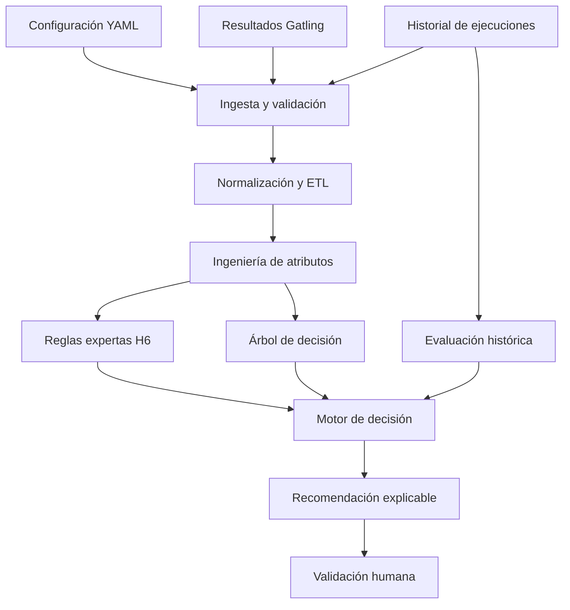

# Gatling AI Performance Copilot

## Descripción del proyecto y resultados obtenidos

**Proyecto Capstone — Magíster en Inteligencia Artificial**  
**Universidad Adolfo Ibáñez**  
**Autores:** Luis Araya, Rodrigo González y Hernán Medina

---

## 1. Resumen ejecutivo

Gatling AI Performance Copilot es una prueba de concepto que automatiza el análisis de configuraciones y resultados de pruebas de rendimiento ejecutadas con Gatling.

El proyecto transforma archivos técnicos dispersos en una recomendación explicable para apoyar la decisión sobre la siguiente prueba. La solución combina:

- Reglas expertas basadas en criterios técnicos.
- Procesamiento de resultados históricos.
- Ingeniería de atributos.
- Un modelo de machine learning explicable.
- Comparación con ejecuciones anteriores.
- Generación de reportes y artefactos auditables.

El sistema no reemplaza al especialista ni modifica automáticamente una prueba. Su salida debe ser revisada y aprobada por una persona.

---

## 2. Problema abordado

La ejecución de una prueba de rendimiento genera información en diferentes formatos y ubicaciones. Antes de decidir si una configuración puede mantenerse o debe revisarse, el especialista necesita:

1. Revisar la configuración de la prueba.
2. Consolidar métricas de rendimiento.
3. Verificar errores y criterios de aceptación.
4. Comparar la ejecución con antecedentes históricos.
5. Interpretar los resultados.
6. Justificar la siguiente acción.

Este proceso es principalmente manual, depende de conocimiento especializado y puede dificultar la trazabilidad de la decisión.

El proyecto busca reducir ese trabajo de preparación analítica, entregando una recomendación reproducible acompañada por la evidencia que la originó.

---

## 3. Objetivo

Automatizar el análisis de configuraciones, resultados e historial de pruebas Gatling para generar, en minutos, una recomendación técnica explicable sobre la siguiente acción.

Las recomendaciones consideradas por el diseño son:

| Recomendación | Interpretación |
|---|---|
| `maintain` | Mantener la configuración evaluada. |
| `review` | Revisar la configuración o los resultados antes de continuar. |
| `evolve` | Evaluar una evolución controlada de la prueba. |

En el dataset utilizado para el primer experimento solo existieron casos reales etiquetados como `maintain` y `review`. Por esta razón, `evolve` no fue entrenada como clase del modelo.

---

## 4. Entradas y salidas

### Entradas principales

- `performance.yaml`: definición general de la prueba.
- `parametricConfigurationValues.yaml`: parámetros de ejecución.
- `global_stats.json`: métricas globales obtenidas por Gatling.
- `stats.json`: estadísticas detalladas de la ejecución.
- `assertions.json`: resultados de los criterios de aceptación.
- `simulation.log`: registro técnico de la simulación.
- Histórico de ejecuciones comparables.

### Salidas principales

- Recomendación: `maintain`, `review` o `evolve`.
- Explicación de las señales utilizadas.
- Dataset normalizado.
- Reporte del entrenamiento.
- Explicación del modelo.
- Reporte HTML del pipeline.
- Artefactos para auditoría y reproducción del análisis.

---

## 5. Flujo de funcionamiento



El flujo implementado integra la configuración, los parámetros, los resultados y el histórico en un pipeline reproducible. La recomendación final conserva la intervención humana como control obligatorio.

---

## 6. Preparación de los datos

### 6.1 Construcción del dataset

El levantamiento histórico detectó 59 ejecuciones. El proceso de depuración produjo el siguiente embudo:

| Etapa | Ejecuciones | Resultado |
|---|---:|---|
| Ejecuciones históricas detectadas | 59 | Universo inicial encontrado. |
| Ejecuciones con estructura completa | 29 | Contenían los artefactos requeridos. |
| Ejecuciones excluidas | 1 | Ejecución abortada o no comparable. |
| Registros finales válidos | 28 | Dataset utilizado en el experimento. |

El dataset inicial tenía 27 columnas. Después del tratamiento de calidad se conservaron 26 variables disponibles.

### 6.2 Distribución de la variable objetivo

| Clase | Registros | Proporción |
|---|---:|---:|
| `maintain` | 20 | 71,4 % |
| `review` | 8 | 28,6 % |
| **Total** | **28** | **100 %** |

Esta distribución presenta desbalance de clases. Por ello, la evaluación no se basó únicamente en accuracy; se utilizaron principalmente Macro-F1 y balanced accuracy.

### 6.3 Calidad de datos

Los principales resultados del proceso de calidad fueron:

- 0 registros duplicados detectados.
- 0 % de filas eliminadas por valores atípicos.
- 1 ejecución excluida por no ser comparable.
- `p90_response_time_ms` presentó 28 de 28 valores nulos y fue excluida.
- Los valores extremos se conservaron porque en rendimiento pueden representar degradaciones reales y no necesariamente errores de medición.

---

## 7. Variables analizadas

El modelo evaluó información proveniente tanto de la configuración como de los resultados de la prueba.

| Grupo | Ejemplos | Propósito |
|---|---|---|
| Carga | Usuarios, concurrencia y tipo de carga | Representar la presión aplicada durante la prueba. |
| Rendimiento | TPS y volumen de solicitudes | Medir capacidad y trabajo procesado. |
| Latencia | p95 y margen respecto del SLA | Medir tiempos de respuesta y cumplimiento. |
| Errores | Tasa de error | Identificar fallas durante la ejecución. |
| Criterios técnicos | Assertions fallidas y advertencias | Registrar incumplimientos detectados. |
| Contexto | Historial comparable | Relacionar la ejecución actual con antecedentes. |

Las variables de carga, concurrencia, TPS, volumen e historial comparable sí fueron evaluadas. En el árbol entrenado con esta muestra no aportaron separación adicional, pero esto no permite concluir que sean irrelevantes en otros escenarios o en un dataset de mayor tamaño.

### Atributos derivados

Durante la ingeniería de atributos se generaron señales con significado técnico, entre ellas:

- Cumplimiento del SLA.
- Cantidad de assertions fallidas.
- Margen entre la latencia observada y el SLA.
- Disponibilidad de historial comparable.
- Indicadores derivados de advertencias y validaciones.

---

## 8. Enfoque de inteligencia

La solución utiliza un enfoque híbrido.

### Reglas expertas

Representan criterios técnicos explícitos y auditables. Permiten mantener controles conservadores ante fallas, incumplimientos de SLA o resultados que requieren revisión.

### Machine learning

Se entrenó un árbol de decisión por su interpretabilidad. El objetivo experimental fue evaluar si un modelo sencillo podía aprender patrones presentes en el histórico y reproducir las decisiones etiquetadas.

### Evaluación histórica

La recomendación actual se contrasta con ejecuciones anteriores comparables. Un buen historial no anula una falla presente: ante incumplimientos actuales, el diseño prioriza la revisión.

### Validación humana

La recomendación funciona como apoyo a la decisión. La aprobación definitiva continúa bajo responsabilidad del especialista.

---

## 9. Evaluación del modelo

### 9.1 Protocolo

- Modelo: árbol de decisión.
- Dataset: 28 ejecuciones.
- Clases: 20 `maintain` y 8 `review`.
- Evaluación: 10 particiones estratificadas con semillas diferentes.
- Por repetición: 21 registros de entrenamiento y 7 de prueba.
- Baseline: clasificador que siempre predice la clase mayoritaria.

### 9.2 Resultados agregados

| Métrica | Árbol de decisión | Baseline mayoritario |
|---|---:|---:|
| Macro-F1 observado | 1,0000 | 0,4167 |
| Accuracy del baseline | — | 0,7143 |
| Semillas evaluadas | 10 | — |
| Desviación del Macro-F1 | 0,0000 | — |
| Macro-F1 mínimo | 1,0000 | — |
| Macro-F1 máximo | 1,0000 | — |

El resultado se mantuvo estable en las diez particiones evaluadas. Sin embargo, debe interpretarse dentro del alcance de la muestra disponible.

### 9.3 Interpretación correcta

El Macro-F1 observado de 1,0000 no demuestra que el modelo generalice a nuevas organizaciones, microservicios o condiciones operacionales.

Las etiquetas fueron generadas a partir del motor experto H6 y algunas variables predictoras contienen señales relacionadas con ese mismo proceso. Por lo tanto, el resultado mide principalmente la capacidad del árbol para reproducir las etiquetas históricas disponibles.

La ausencia de dispersión entre semillas tampoco elimina esta limitación: las particiones provienen del mismo dataset pequeño y de una única fuente de verdad.

En consecuencia, este resultado debe entenderse como:

> Evidencia experimental de fidelidad interna respecto del histórico etiquetado, no como garantía de generalización ni como reemplazo del criterio experto.

---

## 10. Hallazgos principales

1. **Fue posible automatizar el flujo completo.**  
   La prueba de concepto procesa configuración, parámetros, resultados e historial hasta producir una recomendación explicable.

2. **La calidad de los datos históricos es una restricción relevante.**  
   Solo 29 de 59 ejecuciones tenían la estructura completa y una de ellas debió excluirse.

3. **Existe desbalance de clases.**  
   La muestra contiene 20 casos `maintain` y 8 `review`; no existen casos reales suficientes para entrenar `evolve`.

4. **El árbol reproduce las decisiones históricas de la muestra.**  
   El modelo obtuvo un Macro-F1 observado de 1,0000 en las diez particiones, frente a 0,4167 del baseline mayoritario.

5. **El resultado perfecto requiere cautela.**  
   El tamaño reducido del dataset, el origen de las etiquetas y la posible presencia de variables proxy impiden afirmar generalización.

6. **Las variables sin importancia en esta muestra no deben descartarse.**  
   Carga, concurrencia, TPS, volumen e historial pueden adquirir valor cuando se incorporen más ejecuciones, fuentes y decisiones independientes.

7. **El valor actual está en la trazabilidad.**  
   El sistema centraliza evidencia, aplica criterios consistentes y explica por qué propone mantener o revisar una prueba.

---

## 11. Caso de validación

En el caso utilizado para validar la integración, la ejecución presentó assertions fallidas:

- Las reglas expertas recomendaron `review`.
- El árbol de decisión también recomendó `review`.
- La evaluación histórica conservó la recomendación.
- El sistema bloqueó una evolución de carga mientras existieran incumplimientos actuales.

La salida final fue revisar la configuración antes de continuar. El caso demostró la integración entre reglas, modelo e historial, además de la generación de una explicación trazable.

---

## 12. Resultados técnicos del proyecto

La implementación logró:

- Consolidar resultados históricos de Gatling.
- Validar la presencia y estructura de los archivos requeridos.
- Normalizar métricas provenientes de diferentes ejecuciones.
- Construir un dataset reutilizable.
- Ejecutar ingeniería de atributos.
- Entrenar y evaluar un árbol de decisión explicable.
- Comparar el modelo con un baseline mayoritario.
- Ejecutar una evaluación multisemilla.
- Generar recomendaciones mediante un enfoque híbrido.
- Producir reportes y artefactos de auditoría.
- Integrar el proceso mediante una interfaz de línea de comandos.
- Ejecutar un pipeline local desde los archivos de entrada hasta el reporte final.

Comandos disponibles en la CLI del proyecto:

```text
pde doctor
pde quadrant
pde normalize
pde recommend
pde dataset
pde dataset-batch
pde train-model
pde explain-model
pde pipeline
```

Ejemplo del pipeline integrado:

```powershell
pde pipeline `
  --performance .\examples\input\performance.yaml `
  --parameters .\examples\input\parametricConfigurationValues.yaml `
  --results .\examples\input\global_stats.json `
  --output-dir .\examples\output\pipeline
```

En la ejecución local validada, el pipeline completó el proceso, generó una recomendación `maintain` y produjo el reporte `report.html`.

---

## 13. Impacto esperado

El proyecto busca reducir el tiempo dedicado a consolidar resultados y preparar una recomendación técnica.

La hipótesis operacional es llevar esa etapa desde un proceso manual a una generación en minutos, manteniendo la validación humana.

Se estimó un beneficio bruto potencial cercano a **$12,1 millones CLP anuales**, utilizando los siguientes supuestos:

- 12 atenciones mensuales.
- 144 atenciones anuales.
- Costo promedio ponderado cercano a $224.000 CLP por atención.
- Cobertura inicial del 50 %.
- Meta preliminar de reducción del esfuerzo abordado del 75 %.

Esta cifra es referencial. No representa un ahorro demostrado y deberá validarse mediante un piloto que mida tiempo, retrabajo y costo antes y después de utilizar la solución.

---

## 14. Limitaciones

- Dataset reducido: 28 ejecuciones válidas.
- Clases desbalanceadas.
- Ausencia de casos reales para entrenar `evolve`.
- Etiquetas originadas por una única fuente de verdad: el motor H6.
- Posible fuga de información o presencia de variables proxy.
- Evaluación realizada con particiones del mismo histórico.
- Falta de validación temporal y externa.
- Falta de etiquetas independientes revisadas por especialistas.
- El detalle completo de cada partición multisemilla no quedó preservado en el artefacto agregado disponible.
- El impacto económico aún no ha sido validado mediante un piloto operacional.

---

## 15. Próximos pasos

1. Incorporar nuevas ejecuciones de diferentes microservicios y escenarios.
2. Obtener etiquetas revisadas de forma independiente por especialistas.
3. Separar temporalmente entrenamiento y evaluación para simular uso futuro.
4. Eliminar o controlar variables que puedan actuar como proxy de la etiqueta.
5. Registrar las métricas, predicciones y particiones de cada semilla.
6. Evaluar el desempeño por microservicio, tipo de carga y condición operacional.
7. Incorporar casos reales de la clase `evolve` cuando existan suficientes ejemplos.
8. Comparar nuevas alternativas de modelo solo cuando el volumen y diversidad de datos lo justifiquen.
9. Ejecutar un piloto con medición antes/después del tiempo de análisis y las reejecuciones.
10. Mantener auditoría, versionado y aprobación humana antes de una integración productiva.

---

## 16. Conclusión

Gatling AI Performance Copilot demuestra que es posible convertir configuraciones, métricas e historial de pruebas de rendimiento en una recomendación reproducible, explicable y auditable.

El principal aporte actual no es afirmar que el modelo resuelve universalmente la decisión, sino establecer un pipeline técnico completo que:

- Ordena evidencia dispersa.
- Aplica criterios consistentes.
- Conserva trazabilidad.
- Permite experimentar con machine learning explicable.
- Mantiene al especialista como responsable de la decisión final.

Los resultados del modelo son prometedores como prueba de fidelidad interna, pero todavía requieren más datos, etiquetas independientes y validación externa para demostrar generalización. La evolución del proyecto debe enfocarse en mejorar esa evidencia y medir su impacto operacional mediante un piloto controlado.
